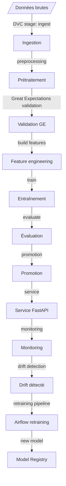

# Demande — MLOps Plateforme de Prévision de la Demande

> **Prévision de la demande en distribution de détail — boucle MLOps fermée et automatisée.**


**Demande** est la plateforme MLOps de référence pour la prévision des ventes :
ingestion, validation, entraînement, service d'inférence, monitoring de drift et
réentraînement automatique.

> Modèle : **RandomForestRegressor** prédisant les **unités vendues (`units_sold`)** par magasin (`store_id`) et par SKU (`sku_id`), avec évaluation par portes de qualité (**R² ≥ 0,60 ; MAPE ≤ 25 %**), monitoring de drift (test de Kolmogorov-Smirnov) et boucle de réentraînement automatique déclenchée par drift.

Cette plateforme illustre le cycle de vie complet d'un système MLOps de prévision de la demande, de l'ingestion des données jusqu'à la détection de drift en production et au réentraînement automatique. Le dépôt démontre l'architecture sur un **jeu de données synthétique de démonstration** (voir [Risques honnêtes](#risques-honnêtes)).

La spécification technique complète est dans [`mlops-project-documentation.md`](mlops-project-documentation.md).

---

## Sommaire

- [Présentation](#présentation)
- [Architecture](#architecture)
- [Stack technique](#stack-technique)
- [Structure du dépôt](#structure-du-dépôt)
- [Démarrage rapide](#démarrage-rapide)
- [Pipeline ML et orchestration](#pipeline-ml-et-orchestration)
- [API d'inférence](#api-dinférence)
- [Monitoring](#monitoring)
- [CI/CD](#cicd)
- [Déploiement Kubernetes](#déploiement-kubernetes)
- [Risques honnêtes](#risques-honnêtes)
- [Documentation détaillée](#documentation-détaillée)
- [Dépannage](#dépannage)

---

## Présentation

Le projet démontre une boucle MLOps fermée et automatisée pour la prévision de la demande :

1. **Ingestion et versioning** : les données brutes sont ingérées (`ingestion.py`), nettoyées (`preprocessing.py` : coercition numérique, suppression des invalides, `units_sold ≥ 0`) et versionnées par **DVC** vers un remote **MinIO** (S3-compatible).
2. **Validation des données** : suites d'attentes **Great Expectations** (`validation.py`, fallback intégré si la bibliothèque absente) — exécutées en CI et dans les DAGs Airflow avant tout entraînement.
3. **Feature engineering** : le `FeatureTransformer` (moyenne/écart-type par feature, ordre fixe) transforme les données en features ; la config est sérialisée dans `features_config.json` pour une **parité entraînement/inférence** garantie.
4. **Entraînement** : **RandomForestRegressor** (300 arbres, profondeur 15) sur split 80/20, avec tracking **MLflow** (hyperparamètres, métriques `rmse`/`mae`/`r2`/`mape`, artefacts `feature_importances.png` et `predictions_vs_actual.png`) et enregistrement au **MLflow Model Registry** (`demand_model`).
5. **Évaluation avec portes** : `evaluate.py` vérifie **R² ≥ 0,60** et **MAPE ≤ 25 %** sur le jeu de test ; le rapport est écrit dans `models/evaluation/latest_report.json` et un échec bloque le pipeline (code non nul).
6. **Promotion conditionnelle** : `promote.py` ne promeut un candidat Staging vers Production que s'il a passé les portes **et** bat le modèle en production sur le même jeu de test ; l'ancienne version est archivée.
7. **Service d'inférence** : API **FastAPI** — `POST /predict` (prévision unitaire ou par lot), `GET /health`, `GET /model-info`, `GET /metrics` (Prometheus), et un dashboard web (`GET /`). Le modèle est chargé depuis le registry avec fallback local `models/model.pkl`.
8. **Monitoring** : **Prometheus/Grafana** (latence, erreurs, distribution des prévisions, alerte `ModelPredictionShift`) et **drift de données** par test de Kolmogorov-Smirnov par feature (`drift_detection.py`), avec alertes Slack + journal local (`alerts.jsonl`).
9. **Boucle de réentraînement** : Airflow — ingestion nocturne (`data_ingestion_dag`), entraînement hebdomadaire (`training_pipeline`), et réentraînement quotidien déclenché par drift (`retraining_pipeline`, short-circuit si pas de drift).

---

## Architecture



Voir [`docs/architecture.md`](docs/architecture.md) pour le schéma complet et le rôle de chaque composant.

---

## Stack technique

| Domaine | Outil |
|---|---|
| Versioning des données | **DVC** + **MinIO** (remote S3-compatible) |
| Validation des données | **Great Expectations** |
| Tracking + registry | **MLflow** (Postgres backend, MinIO artefacts) |
| Orchestration | **Apache Airflow** |
| Modèle | **RandomForestRegressor** (scikit-learn) |
| Service d'inférence | **FastAPI** + Pydantic |
| CI/CD | **GitHub Actions** (lint, bandit, GE, tests ; CD staging → production approuvée) |
| Déploiement | **Docker** (multi-stage) + **Kubernetes/Kustomize** (HPA, overlays staging/production) |
| Monitoring | **Prometheus** + **Grafana** ; drift : tests KS (scipy) + alerting Slack/journal |

---

## Structure du dépôt

```
.
├── airflow/                 # DAGs (ingestion, training, retraining) + DriftDetectedSensor
├── src/
│   ├── data/                # ingestion, preprocessing, validation (GE)
│   ├── features/            # build_features (FeatureTransformer), feature_store
│   ├── models/              # train (RF), evaluate (portes), promote
│   ├── api/                 # main (FastAPI), schemas (Pydantic), model_loader, metrics
│   └── monitoring/          # drift_detection (KS), alerting (Slack + journal)
├── tests/                   # 57 tests : 41 unit, 14 data quality, 2 integration
├── docker/                  # Dockerfile.api (multi-stage, non-root), docker-compose.yml
├── k8s/                     # base + overlays staging/production (Kustomize)
├── monitoring/              # prometheus (config + alert rules), grafana dashboards
├── data/                    # external, raw, processed, features, monitoring
├── models/                  # model.pkl, artifacts, evaluation reports
├── ui/                      # index.html — dashboard de prévision
├── dvc.yaml                 # pipeline DVC : ingest → preprocess → features → train
└── mlops-project-documentation.md   # spécification technique complète
```

---

## Démarrage rapide

Prérequis : Python 3.11+, `make`.

```bash
make setup              # virtualenv + dépendances dev
make data               # génère le jeu de données synthétique (scripts/generate_synthetic_data.py)
make ingest             # DVC stage 1 — ingère les données brutes
make preprocess         # DVC stage 2 — nettoyage
make validate           # validation Great Expectations
make features           # DVC stage 3 — features + config
make train              # DVC stage 4 — entraînement + tracking MLflow + registry
make evaluate           # évaluation vs portes R² ≥ 0,60 / MAPE ≤ 25 %
make promote            # promotion Staging → Production (si portes passées)
make api                # uvicorn src.api.main:app — service d'inférence sur :8000
make drift              # détection de drift (référence vs courant)
make test               # pytest — 57 tests
```

Ou en une commande : `dvc repro` (rejoue les 4 étapes du pipeline si nécessaire).

### Test rapide de l'API

```bash
curl -X POST http://localhost:8000/predict \
  -H "Content-Type: application/json" \
  -d '{"store_id":21,"sku_id":77,"day_of_week":5,"month":5,"is_holiday":0,
       "price":14.58,"promotion":1,"temperature":84.9,"inventory_level":59,
       "competitor_price":16.91,"store_traffic":758}'
# → {"predicted_units":52,"demand_bucket":"high","model_name":"demand_model","model_version":"local"}
```

### Stack locale complète (Docker)

```bash
docker compose -f docker/docker-compose.yml up -d --build
# MinIO :9000/9001 · MLflow :5000 · Airflow :8080 · API :8000 · Prometheus :9090 · Grafana :3000
```

---

## Pipeline ML et orchestration

Pipeline DVC (`dvc.yaml`) : `ingest` → `preprocess` → `build_features` → `train`.

- **Features (11)** : `store_id, sku_id, day_of_week, month, is_holiday, price, promotion, temperature, inventory_level, competitor_price, store_traffic` — cible : `units_sold`.
- **Métriques** : `rmse`, `mae`, `r2`, `mape` (MAPE hors `y = 0`).
- **Portes** : `min_r2 ≥ 0.60`, `max_mape ≤ 25.0` (`evaluate.py`, seuils par défaut, surchargeables via CLI `--min-r2` / `--max-mape`).

DAGs Airflow :

| DAG | Planification | Rôle |
|---|---|---|
| `data_ingestion_dag` | Quotidien 02:00 | ingest → validate (GE) → `dvc add` + `dvc push` (MinIO) |
| `training_pipeline` | Hebdomadaire | validate → preprocess → features → train → evaluate → promote → notify |
| `retraining_pipeline` | Quotidien | `check_drift` (short-circuit) → si drift : preprocess → features → train → evaluate → promote-si-meilleur → notify |

Le plugin `DriftDetectedSensor` (airflow/plugins/drift_sensor.py) sonde `data/monitoring/drift_report.json` et réussit dès que `drift_detected=true`.

---

## API d'inférence

| Endpoint | Méthode | Description |
|---|---|---|
| `/predict` | POST | Prévision unitaire ou par lot (liste) ; validation Pydantic stricte, 422 si invalide |
| `/health` | GET | `{"status":"ok", "model_name":…, "model_version":…}` ou `{"status":"degraded"}` |
| `/model-info` | GET | Nom, version, run_id, métriques de production (si rapport présent) |
| `/metrics` | GET | Métriques Prometheus (`http_*`, `model_prediction_value`, `predictions_total`, `mlops_model_version`) |
| `/` | GET | Dashboard web de prévision |
| `/docs` | GET | Documentation OpenAPI interactive |

Réponse `/predict` : `{"predicted_units": 47, "demand_bucket": "high", "model_name": "demand_model", "model_version": "3"}` — buckets : `low` (≤ 15), `medium` (≤ 35), `high` (≤ 60), `very_high` (> 60).

Chargement du modèle : `MLFLOW_MODEL_URI` explicite → registry `models:/demand_model/Production` → fallback local `models/model.pkl`. Rechargement périodique via `RELOAD_INTERVAL` (env, secondes).

Voir [`docs/api.md`](docs/api.md) pour la référence complète.

---

## Monitoring

- **Prometheus** scrape `/metrics` (15 s) ; règles d'alerte dans `monitoring/prometheus/alert_rules.yml` : `HighAPILatency` (p95 > 500 ms), `HighAPIErrorRate` (> 5 % 5xx), `APIInstanceDown`, `ModelPredictionShift` (distribution des prévisions).
- **Grafana** : dashboards provisionnés `api-performance.json` et `model-drift.json`.
- **Drift** (`src/monitoring/drift_detection.py`) : test KS à deux échantillons par feature (`p < 0.05` et `stat > 0.1`), score global = fraction de features dérivées, seuil 0,3 (env `DRIFT_THRESHOLD`), rapport dans `data/monitoring/drift_report.json`.
- **Alertes** (`alerting.py`) : Slack (env `SLACK_WEBHOOK_URL`) + journal local `data/monitoring/alerts/alerts.jsonl` toujours écrit.

Voir [`docs/monitoring.md`](docs/monitoring.md).

---

## CI/CD

- **CI** (`ci.yml`, chaque push/PR) : lint (ruff + black), sécurité (bandit, échec sur HIGH), validation GE, tests unitaires, tests d'intégration, tests de données.
- **CD** (`cd.yml`, merge sur `main` et changements `src/`/`docker/`/`k8s/`/requirements/dvc) : build image GHCR taguée au sha (jamais `latest`) → déploiement **staging** (Kustomize, rollout, smoke `/health`) → déploiement **production** derrière **approbation manuelle** (GitHub Environments).

Voir [`docs/deployment.md`](docs/deployment.md).

---

## Déploiement Kubernetes

- `k8s/base/` : Deployment (3 replicas, RollingUpdate `maxUnavailable: 0`, probes `/health`), Service ClusterIP, ConfigMap (`MLFLOW_TRACKING_URI`, `MLFLOW_MODEL_NAME`, `RELOAD_INTERVAL`), HPA (min 2, max 10 pods ; CPU 70 %, mémoire 80 %).
- `k8s/overlays/staging/` : 2 replicas, ressources réduites.
- `k8s/overlays/production/` : 5 replicas, ressources augmentées.

Le modèle n'est pas embarqué dans l'image : l'API charge la version Production du registry MLflow (fallback local). Le changement de modèle se fait par promotion dans le registry + redéploiement, ou rechargement via `RELOAD_INTERVAL`.

---

## Risques honnêtes

**Le modèle actuel ne passe pas ses portes de qualité.** `models/evaluation/latest_report.json` : R² ≈ −0,68, MAPE ≈ 49 % (n=100) ; `metrics.json` : R² ≈ −0,12, RMSE ≈ 22,8, MAPE ≈ 105 %. Le pipeline, le service et le monitoring fonctionnent — le **pouvoir prédictif du modèle reste faible**. Les pistes : features temporelles (lags, moyennes mobiles), alternative GBM, recherche d'hyperparamètres (voir roadmap dans la spécification).

**Les données sont synthétiques et petites.** Le jeu de démonstration (`data/raw/demand_data.csv`) ne représente pas une chaîne réelle ; aucune performance de production ne peut en être déduite.

**Le feature engineering est minimal.** La colonne `date` n'est pas utilisée par le modèle ; la saisonnalité temporelle n'est pas encore capturée.

---

## Documentation détaillée

| Document | Contenu |
|---|---|
| [`mlops-project-documentation.md`](mlops-project-documentation.md) | Spécification technique complète (architecture, composants, DoD, risques, roadmap) |
| [`docs/api.md`](docs/api.md) | Référence API complète (requêtes/réponses, validation, erreurs) |
| [`docs/architecture.md`](docs/architecture.md) | Architecture en couches et flux de données |
| [`docs/deployment.md`](docs/deployment.md) | Stack Docker, DVC remote, déploiement Kubernetes + CD |
| [`docs/monitoring.md`](docs/monitoring.md) | Monitoring Prometheus/Grafana, drift, alerting |
| [`docs/ml-pipeline.md`](docs/ml-pipeline.md) | Pipeline ML détaillé (DVC, features, training, évaluation, promotion) |

---

## Dépannage

| Symptôme | Cause probable | Solution |
|---|---|---|
| `make train` échoue sur features introuvables | Étapes DVC non exécutées | `dvc repro` ou `make data ingest preprocess features` |
| L'API répond `{"status":"degraded"}` | Modèle non chargé (registry + local absents) | `make train`, ou définir `MLFLOW_MODEL_URI` |
| `evaluate.py` sort en erreur | Portes non passées (comportement attendu) | Améliorer le modèle ; forcer avec `--min-r2`/`--max-mape` ou `promote.py --force` (déconseillé) |
| `/predict` renvoie 422 | Payload hors plages Pydantic | Vérifier les bornes documentées dans `docs/api.md` |
| Pas d'alertes Slack | `SLACK_WEBHOOK_URL` non défini | Configurer l'env ; le journal local est toujours écrit |
| `retraining_pipeline` ne fait rien | Pas de drift détecté (short-circuit) | Comportement nominal ; vérifier `drift_report.json` |